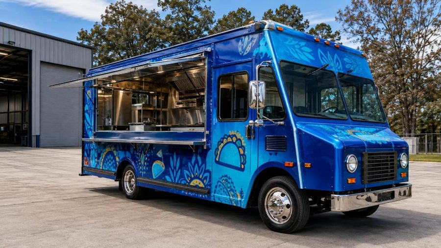

# US Food Truck Factory — sayt

Statik sayt: **HTML + CSS + vanilla JS**. Build addımı, framework və ya asılılıq yoxdur.
İstənilən hostinqə (Netlify, Vercel, GitHub Pages, cPanel, adi Apache/Nginx) olduğu kimi
yüklənir.

Dizayn göndərdiyiniz mobil maketə əsaslanır (`_tools/reference/homepage-mockup.jpg`),
məzmun isə `usfoodtruckfactory.com` saytından götürülüb.

---

## Səhifələr

| Fayl | Səhifə |
|---|---|
| `index.html` | Ana səhifə |
| `services.html` | Xidmətlər (Build Up / Trailers / Remodel / Repair + FAQ) |
| `builds.html` | Qalereya — filtr + lightbox |
| `parts.html` | Ehtiyat hissələri və avadanlıq |
| `about.html` | Haqqımızda |
| `contact.html` | Əlaqə — form + xəritə |
| `quote.html` | Qiymət sorğusu formu |
| `404.html` | Tapılmadı |

Əlavə: `sitemap.xml`, `robots.txt`.

---

## Qovluq strukturu

```
/
├── *.html                  ← saytın özü (deploy olunan fayllar)
├── sitemap.xml, robots.txt
├── assets/
│   ├── css/
│   │   ├── fonts.css       ← @font-face elanları (lokal şriftlər)
│   │   ├── style.css       ← dizayn sistemi: rənglər, şrift, header, footer, düymələr
│   │   └── components.css  ← səhifə komponentləri: hero, kartlar, form, qalereya…
│   ├── js/
│   │   ├── icons.js        ← SVG ikon sprite (34 ikon) — DOM-a inject olunur
│   │   └── main.js         ← menyu, karusel, qalereya, lightbox, form validasiyası
│   ├── fonts/              ← lokal woff2 (Poppins + Inter) — Google Fonts sorğusu YOXDUR
│   └── images/
│       ├── builds/         ← hazır işlərin şəkilləri
│       ├── gallery/        ← daxili mətbəx fotoları
│       ├── *-sm.jpg        ← 900px thumbnail-lar (aşağıya bax)
│       ├── logo.png, favicon.svg, apple-touch-icon.png
│       ├── hero-*.jpg, svc-*.jpg
├── admin/                  ← admin panel (PHP)
│   ├── index.php           ← login + müraciətlər siyahısı + detal
│   ├── setup.php           ← bir dəfəlik hesab yaratma (sonra silin)
│   ├── logout.php, _boot.php, admin.css, .htaccess
├── api/
│   └── submit.php          ← formların POST etdiyi endpoint
├── data/                   ← SQLite bazası + admin config (HTTP-dən bağlıdır)
│   ├── .htaccess, index.php
└── _tools/                 ← DEPLOY OLUNMUR — yalnız redaktə üçün
    ├── build.py            ← səhifə generatoru
    ├── bodies/*.html       ← hər səhifənin gövdəsi (header/footer olmadan)
    ├── reference/          ← orijinal dizayn maketi və ikon vərəqi
    └── removed/            ← silinmiş səhifələr (geri qaytarmaq üçün saxlanılır)
```

---

## Səhifələri redaktə etmək

Header və footer 9 səhifədə eynidir. Onları sinxron saxlamaq üçün kiçik generator var.

**Bir səhifənin məzmununu dəyişmək:**

1. `_tools/bodies/<səhifə>.html` faylını redaktə et
2. `python _tools/build.py` işlət
3. Kök qovluqdakı `<səhifə>.html` yenilənir

**Header, footer, menyu, əlaqə məlumatları və ya `<title>` dəyişmək:**

`_tools/build.py` faylının yuxarısındakı `SITE`, `NAV`, `FOOTER_LINKS`, `SOCIAL`, `PAGES`
bloklarını redaktə et, sonra `python _tools/build.py`.

> Generator yalnız rahatlıq üçündür. Kök qovluqdakı `.html` faylları tam işlək,
> müstəqil HTML-dir — istəsən birbaşa da redaktə edə bilərsən (o halda header/footer
> dəyişikliyini hər faylda əl ilə təkrarlamaq lazımdır).

---

## Şəkil qaydası — `-sm.jpg` thumbnail-lar

Hər fotonun **iki** versiyası var:

| Fayl | Ölçü | Harada işlənir |
|---|---|---|
| `taco-azul.jpg` | orijinal (1600×900 / 1200×1600) | yalnız lightbox və ana səhifə hero-su |
| `taco-azul-sm.jpg` | **900×506** (üfüqi mənbə) | kartlar, grid, feature sətirləri |
| `interior-cab-sm.jpg` | **900×675** (şaquli mənbə, 4:3 kəsilmiş) | eyni yerlərdə |

Şaquli fotolar əvvəlcədən 4:3 formatına **mərkəzdən kəsilir** — bu, `object-fit: cover`-in
onsuz da göstərdiyi kadrdır, yəni vizual dəyişiklik yoxdur, sadəcə lazımsız piksellər
yüklənmir.

Bu, səhifə çəkisini **45–53% azaldır** (builds.html: 3.6 MB → 1.7 MB).

Qalereyada hər `` belədir:

```html

```

`main.js` lightbox-u açanda `data-full`-u üstün tutur — yəni grid kiçik faylı,
lightbox isə orijinalı yükləyir.

### Yeni şəkil əlavə edəndə

1. Orijinalı `assets/images/...` içinə at
2. `-sm.jpg` versiyasını yarat (Photoshop, [squoosh.app](https://squoosh.app),
   ImageMagick — hər hansı alət), JPEG keyfiyyəti **~82**:
   - üfüqi foto → eni **900px**-ə kiçilt (kəsmə yoxdur)
   - şaquli foto → mərkəzdən 4:3 kəs, sonra **900×675**-ə kiçilt
3. HTML-də `src`-ə `-sm.jpg`-ni yaz; qalereyadadırsa `data-full`-a orijinalı yaz

> Yalnız orijinalı qoysan da sayt işləyir — sadəcə səhifə ağır olur.

---

## Deploydan əvvəl qalan işlər

Aşağıdakı maddələr həll olundu — qalan **1 maddə sizdən asılıdır**.

### ✅ Həll olunub

| Məsələ | Nəticə |
|---|---|
| Telefon nömrəsi | **(240) 360-0000** — canlı saytda 15 yerdə keçən nömrə. Bütün `tel:` linkləri, mətnlər və JSON-LD yeniləndi. |
| Facebook linki | `facebook.com/usfoodtruckfactory` — canlı saytdan tapıldı, footer və JSON-LD `sameAs`-a yazıldı. |
| Form "ölü link" xətası | Form artıq `action="mailto:…"`-dur. Əvvəl JS sönülü olsa 404-ə POST edirdi. |
| Domen | `usfoodtruckfactory.com` — dəyişməyə ehtiyac yoxdur. |
| "For Sale" səhifəsi | Silindi. Bununla təmsilçi foto məsələsi də aradan qalxdı. Gövdəsi `_tools/removed/for-sale.html`-də saxlanılır — geri qaytarmaq üçün `build.py`-a `PAGES`, `NAV`, `FOOTER_LINKS` sətirlərini əlavə edib fayllı `bodies/`-ə köçürmək kifayətdir. |
| Tab ikonu | Truck konturu 16px-də oxunmurdu — brend "US" monoqramı ilə əvəz olundu. Kvadrat `apple-touch-icon.png` (180×180) da əlavə edildi. |
| Bayraq ikonu | Zolaqlar ulduzlu sahənin içindən keçirdi. Düzgün quruluşla yenidən çəkildi. |
| Telefon nömrələri | Saytın hər yerindən silindi (footer, əlaqə kartı, CTA düymələri, JSON-LD). Doğru nömrəni göndərəndə bir yerdən əlavə edilir. |
| Facebook linki | Footer-dən çıxarıldı. Heç bir sosial profil qalmadığı üçün "Follow Us" sütunu tamamilə gizlədilir, footer 2 sütuna keçir. |
| Form → admin panel | Müraciətlər artıq `/admin`-də toplanır. Aşağıdakı bölməyə bax. |

### ⏳ Instagram / YouTube / TikTok linkləri

`_tools/build.py` → `SOCIAL` bloku:

```python
SOCIAL = [
    ('Facebook',  'https://www.facebook.com/usfoodtruckfactory', 'i-facebook'),
    ('Instagram', TODO,   'i-instagram'),   # ← URL-i bura yaz
    ('YouTube',   TODO,   'i-youtube'),
    ('TikTok',    TODO,   'i-tiktok'),
]
```

`TODO`-nun yerinə real profil ünvanını yaz və `python _tools/build.py` işlət — ikon
avtomatik footer-də görünəcək.

> `TODO` qalan sətirlər **render olunmur**. Yəni sayt heç vaxt boş/ölü sosial link
> göstərmir; ikon yalnız real profil olanda çıxır.

---

## Admin panel

Müraciətlər `data/submissions.sqlite` faylında saxlanılır və **`saytiniz.com/admin`**
ünvanından görünür.

### Tələb

**PHP 7.3+ və `pdo_sqlite` uzantısı.** Paylaşılan hostinqlərin (cPanel) demək olar
hamısında var. Verilənlər bazası qurmağa ehtiyac yoxdur — SQLite sadəcə bir fayldır.

> Statik-only hostinqə (GitHub Pages, adi S3) yükləsəniz PHP işləməyəcək. O halda
> `_tools/bodies/contact.html` və `quote.html`-də `data-endpoint`-i `"TODO"` edin —
> formlar e-poçt rejiminə qayıdır.

### Quraşdırma (bir dəfəlik)

1. Bütün faylları hostinqə yükləyin
2. `saytiniz.com/admin/setup.php` ünvanını açın
3. E-poçt və parol (ən azı 10 simvol) yazın → hesab yaranır, dərhal panelə girirsiniz
4. **`admin/setup.php` faylını serverdən silin** — səhifə onsuz da özünü kilidləyir,
   amma silmək daha təmizdir

Bundan sonra giriş: `saytiniz.com/admin`

### Nə göstərir

Siyahıda: tarix, ad, telefon, e-poçt, mesajın başlanğıcı, hansı formadan gəldiyi.
Oxunmamışlar qalın şriftlə və mavi zolaqla işarələnir.

Detal səhifəsində: tam mesaj + formadakı bütün əlavə sahələr (büdcə, vaxt, maliyyələşdirmə
və s.), "E-poçtla cavab ver", "Oxunmamış işarələ", "Sil" düymələri.

### Təhlükəsizlik

Bunların hamısı yazıldı və **real olaraq test edildi**:

| Qoruma | Necə |
|---|---|
| Parol | `password_hash()` bcrypt. Açıq mətn heç yerdə saxlanılmır |
| Sessiya | `httponly` + `samesite=Strict` cookie, HTTPS-də `secure`, girişdə `session_regenerate_id()` |
| Brute-force | Bir IP-dən 5 səhv cəhddən sonra 15 dəqiqə kilid — kilidli ikən düzgün parol da qəbul edilmir |
| İstifadəçi sızması | Səhv parol və mövcud olmayan e-poçt **eyni** mesajı verir |
| CSRF | Login, silmə və işarələmə əməliyyatlarında token; tokensiz sorğu rədd olunur |
| SQL injection | Hər sorğu PDO prepared statement; `id` parametri `(int)`-ə çevrilir |
| XSS | Müraciət mətnləri ziyarətçidən gəlir — panelə çıxarılan **hər sahə** `htmlspecialchars()`-dan keçir |
| Baza faylı | `data/` qovluğu `.htaccess` ilə bağlıdır, üstəlik `index.php` 404 qaytarır |
| Spam | Honeypot (bota 200 qaytarır, amma yazmır) + bir IP-dən 10 dəqiqədə 5 göndəriş limiti |
| İndeksləmə | Panel səhifələrində `noindex, nofollow` |

> **Vacib:** panel mütləq **HTTPS** üzərindən işləməlidir. HTTP-də sessiya cookie-si
> şəbəkədə açıq gedir. Hostinqinizdə pulsuz Let's Encrypt sertifikatı var.

> Nginx işlədirsinizsə `.htaccess` oxunmur — `data/` qovluğunu bloklamağı server
> konfiqurasiyasında etməlisiniz (`location ^~ /data/ { deny all; }`).

### Parolu unutsanız

`data/config.php` faylını silin, sonra `admin/setup.php`-ni yenidən yükləyib yeni hesab
yaradın. Müraciətlər silinmir — onlar ayrı faylda (`submissions.sqlite`) saxlanılır.

## Nə işləyir

- **Responsiv** — 390px-dən 1440px-ə qədər yoxlanılıb, heç bir eni aşma yoxdur
- **Mobil menyu** — hamburger, Esc ilə bağlanır, link kliklənəndə bağlanır
- **Karusel** (ana səhifə) — ox düymələri, nöqtələr, klaviatura (←/→), toxunma sürüşdürməsi
- **Qalereya** (builds) — kateqoriya filtri + lightbox (Esc, ←/→, fokus dövrü)
- **Formlar** — canlı validasiya, `aria-invalid`, `role="alert"`, honeypot spam qoruması.
  JS sönülü olsa da sınmır: `action="mailto:…"` fallback-i var. Endpoint qoşulan kimi
  `fetch` ilə POST-a keçir (fake endpoint ilə test edilib)
- **Əlçatanlıq** — skip-link, 1 `<h1>` per səhifə, başlıq iyerarxiyasında sıçrayış yoxdur,
  bütün şəkillərdə `alt`, bütün input-larda `<label>`, `prefers-reduced-motion` dəstəyi
- **SEO** — hər səhifədə unikal `<title>` + `description`, canonical, Open Graph,
  Twitter card, ana səhifədə `LocalBusiness` JSON-LD, sitemap, robots
- **Performans** — bütün şəkillərdə **fayla uyğun** `width`/`height` (CLS yoxdur),
  aşağıdakılarda `loading="lazy"`, hero-da `fetchpriority="high"`, kartlarda 900px
  thumbnail-lar. Səhifə şəkil çəkisi baza ilə müqayisədə **45–53% aşağı**
- **Şriftlər lokal** — Poppins + Inter `assets/fonts/` içindədir. Google Fonts-a
  **sıfır xarici sorğu** (GDPR üçün təmiz, render-blokedici `@import` yoxdur).
  İngilis səhifə üçün cəmi ~70 KB; `latin-ext` yalnız aksentli hərf görünsə yüklənir.

Yoxlama nəticəsi: 9 səhifənin hamısı — **0 konsol xətası, 0 uğursuz sorğu, 0 sınıq şəkil**.

---

## Lokal işə salmaq

```bash
python -m http.server 8000
```

Sonra brauzerdə `http://localhost:8000`.

> `file://` ilə də açılır (ikonlar JS-ə daxil edilib, xaricdən yüklənmir), amma
> lokal server daha düzgün nəticə verir.

---

## Sınanmış və rədd edilmiş: WebP

Bütün JPEG-lər WebP-ə (q=0.82) çevrilib ölçüldü — **cəmi 10% qənaət**, bəzi fayllar
hətta böyüdü. Səbəb: bu şəkillər artıq WhatsApp-dan keçib sıxılıb, təkrar lossy
kodlaşdırma yeni fayda vermir, üstəlik keyfiyyət itkisi əlavə edir. Ona görə WebP
tətbiq edilmədi; əvəzinə 900px thumbnail-lar seçildi (35% qənaət, keyfiyyət itkisi
gözlə görünmür).

Gələcəkdə **orijinal, sıxılmamış** fotolar əlavə olunarsa, WebP yenidən dəyərləndirilə
bilər — o halda qazanc adətən 30–50% olur.

## İstəyə bağlı sonrakı təkmilləşdirmələr

- **Analitika** — Google Analytics / Plausible kodu `_tools/build.py` → `head()`
  funksiyasına əlavə olunur (bir dəfə yazılır, 9 səhifəyə düşür).
- **Keşləmə başlıqları** — hostinqdə `assets/` üçün uzunmüddətli `Cache-Control`
  (şriftlər və şəkillər dəyişmir).
